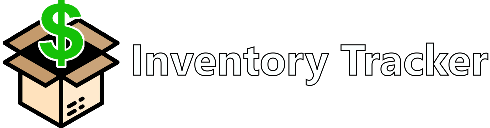

<br />
<div align="center">
  <a href="https://github.com/seyon123/inventory-tracker/" style="color:white; font-size:1.5rem;">
    
  </a>

  <p align="center">
    <h4>Product tracking made easy</h4>
    <br />
    
    
    <br />
    <a href="https://inventory-track.web.app/">Live Demo</a>
    •
    <a href="https://github.com/seyon123/inventory-tracker/issues">Report Bug</a>
    •
    <a href="#getting-started">Local Setup</a>
  </p>
</div>

## Key Features

- Search for products and save them to your wishlist
- Check the historical price history for products
- View recently updated products
- Check product inventory at different stores

- Admin features:
  - Add new products and stores into the system
  - Edit product and store information
  - Update product inventory and price
  - View audit logs for administration actions

## Getting Started

### Dependencies

- Git
- npm

### Installing

In command line:

```
# Clone repository
$ git clone https://gitlab.com/seyon123/inventory-tracker.git

# Go into repository
$ cd inventory-tracker

# Install dependencies
$ npm install

# Run application
$ npm start
```

> **Note** Add a `.env` file to the root. Make sure to configure the file with the right values in order to connect to the Firestore database.

